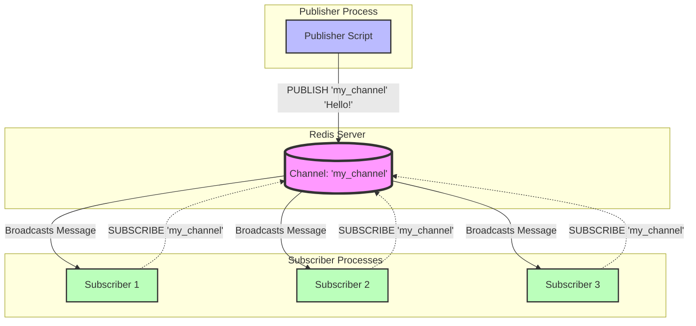
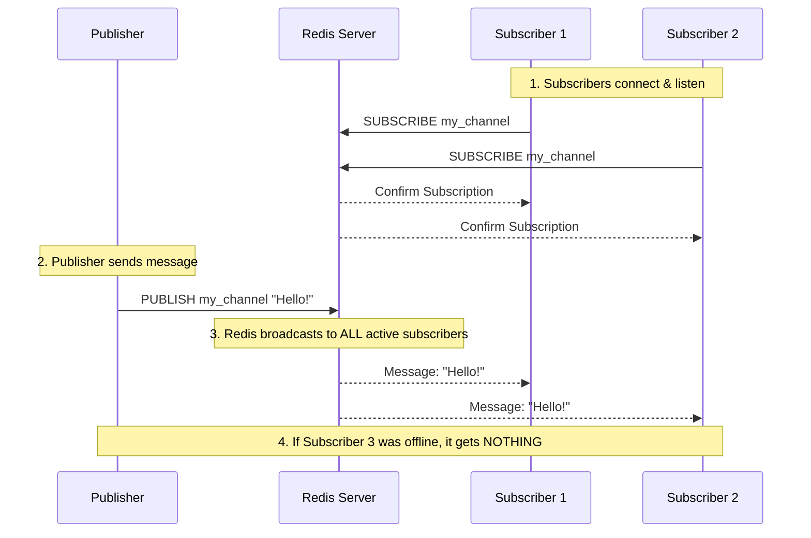

# 7. Redis as Pub/Sub

Redis offers a suite of advanced features that extend its utility beyond simple caching and data storage, enabling complex distributed system patterns.

### Pub/Sub (Publish/Subscribe)

**Description**: Redis Pub/Sub allows clients to subscribe to channels and receive messages published to those channels. It's a fire-and-forget messaging system, meaning messages are not persisted; if a subscriber is not connected, it misses messages published during its downtime.

**Real-World Scenarios**:

- **Real-time Chat**: Users subscribe to chat room channels.
- **Live Notifications**: Push notifications to connected clients (e.g., stock price updates, sports scores).
- **Event-Driven Architectures**: Decoupling services by broadcasting events.

**Code Examples (Python)**:

```python
import redis
import time

def publisher():
    r = redis.Redis(host='localhost', port=6379, db=0)
    print("Publisher started...")
    for i in range(5):
        message = f"Hello World {i}"
        r.publish('mychannel', message)
        print(f"Published: {message}")
        time.sleep(1)

def subscriber():
    r = redis.Redis(host='localhost', port=6379, db=0)
    pubsub = r.pubsub()
    pubsub.subscribe('mychannel')
    print("Subscriber started, listening for messages...")
    for message in pubsub.listen():
        if message['type'] == 'message':
            print(f"Received: {message['data'].decode('utf-8')}")

# To run:
# In one terminal: python -c "from your_module import subscriber; subscriber()"
# In another terminal: python -c "from your_module import publisher; publisher()"
```

Here is a visualization of the Redis Pub/Sub process using the example we discussed.

#### 1. High-Level Architecture Diagram



#### 2. Step-by-Step Flow Chart

Here is how the data flows chronologically:



#### 3. Real-Time Analogy: The Radio Station

Think of Redis Pub/Sub like a **Radio Station**:

| Component | Redis Equivalent | Explanation |
| --- | --- | --- |
| **Radio Station** | **Channel** (`my_channel`) | The frequency/topic being broadcast. |
| **DJ** | **Publisher** | Sends out the audio (message). Doesn't know who is listening. |
| **Listeners** | **Subscribers** | Tune in to the frequency. They receive the audio in real-time. |
| **Turned Off Radio** | **Offline Subscriber** | If you aren't tuned in when the song plays, you miss it forever. |

#### Key Visual Takeaways:

1. **Decoupled**: The Publisher (Blue) does **not** know the Subscribers (Green) exist. It just talks to Redis.
2. **One-to-Many**: One message sent by the Publisher is instantly copied to **all** connected Subscribers.
3. **Ephemeral**: The message exists in Redis only for the microsecond it takes to broadcast. It is **not stored**.

---

To understand how Redis Pub/Sub works internally, we need to look beyond the high-level API and dive into the C data structures and event loop mechanisms that power it.

Redis is single-threaded for command execution. This means Pub/Sub must be extremely efficient to avoid blocking other operations (like `GET` or `SET`).

Here is the deep dive into the internal mechanics:

#### 1. The Core Data Structure: `dict` of Lists

Internally, Redis maintains a global dictionary (hash map) in the server structure to track subscriptions. It looks roughly like this in C pseudocode:

```c
struct redisServer {
    // Key: Channel Name (sds string)
    // Value: List of Client pointers subscribed to this channel
    dict *pubsub_channels;
};
```

#### How it looks in memory:

If you have two channels (`news` and `sports`) and three clients (`C1`, `C2`, `C3`):

```
pubsub_channels (dict)
├── "news"  ──► [ Client*C1, Client*C2 ]
└── "sports" ──► [ Client*C2, Client*C3 ]
```

- **Key**: The channel name (stored as an SDS - Simple Dynamic String).
- **Value**: A linked list (`list`) of pointers to `client` structures.

> **Note**: There is also a separate structure for pattern matching (`pubsub_patterns`), which is a simple linked list of patterns because pattern matching requires iterating through all patterns (O(N)), whereas exact channel lookup is O(1).
> 

---

#### 2. The Subscription Process (`SUBSCRIBE`)

When a client runs `SUBSCRIBE my_channel`:

1. **Lookup**: Redis checks if `"my_channel"` exists in the `pubsub_channels` dict.
2. **Create if Missing**: If the channel doesn’t exist, Redis creates a new entry in the dict with an empty list.
3. **Add Client**: Redis appends the current `client` pointer to the list associated with `"my_channel"`.
4. **Update Client State**: The client’s internal state is updated to reflect that it is now in "subscriber mode."
    - *Important*: Once a client is in subscriber mode, it can **only** run Pub/Sub commands (`SUBSCRIBE`, `UNSUBSCRIBE`, `PING`, `QUIT`). It cannot run `GET`, `SET`, etc., on the same connection.

**Complexity**: O(1) average case (dictionary insert/lookup).

---

#### 3. The Publishing Process (`PUBLISH`)

When a client runs `PUBLISH my_channel "Hello"`:

1. **Lookup**: Redis looks up `"my_channel"` in the `pubsub_channels` dict.
2. **Check Existence**:
    - If the channel **does not exist** (no subscribers), Redis returns `0` immediately. No message is stored.
    - If the channel **exists**, Redis gets the list of subscribed clients.
3. **Iterate & Push**: Redis iterates through the linked list of clients. For each client:
    - It constructs a multi-bulk reply array: `["message", "channel_name", "payload"]`.
    - It pushes this reply into the client’s **output buffer**.
4. **Return Count**: Redis returns the number of clients who received the message.

**Complexity**: O(N) where N is the number of subscribers to that specific channel.

---

#### 4. The Critical Component: Output Buffers

This is the most important part of the deep dive. **Redis does not block the publisher while sending data to slow subscribers.**

Each client in Redis has an **Output Buffer** (a queue of bytes waiting to be sent over the network socket).

### The Flow:

1. `PUBLISH` adds the message to Client A’s output buffer.
2. `PUBLISH` adds the message to Client B’s output buffer.
3. `PUBLISH` command finishes immediately.

### The Event Loop (AeEventLoop):

Redis uses an event loop (based on `epoll` on Linux, `kqueue` on macOS, etc.).

1. The event loop monitors all client sockets for writability.
2. When the network socket for Client A is ready to accept data, Redis drains the output buffer and sends the bytes over TCP.
3. If Client A is slow (e.g., network lag), its output buffer grows.

### ⚠️ The Danger: Buffer Bloat

If a subscriber is very slow or disconnected but the TCP connection isn't closed yet, the output buffer keeps growing.

- Redis has configurable limits (`client-output-buffer-limit pubsub`).
- If a subscriber’s buffer exceeds the limit, Redis **forcefully disconnects** that subscriber to protect the server’s memory and performance.

---

#### 5. Pattern Matching (`PSUBSCRIBE`)

Pattern subscription (e.g., `PSUBSCRIBE news.*`) works differently *because it can’t use a direct dictionary lookup.*

1. **Storage**: Patterns are stored in a global linked list: `server.pubsub_patterns`.
2. **Publishing**: When `PUBLISH news.sports "Goal!"` is called:
    - Redis first handles exact matches (as described above).
    - Then, it iterates through **every** pattern in `pubsub_patterns`.
    - For each pattern, it runs `stringmatchlen()` (glob-style matching) against the channel name `"news.sports"`.
    - If it matches, the message is added to that client’s output buffer.

**Complexity**: O(P) where P is the total number of pattern subscriptions across all clients. This is why pattern matching is slower and more expensive than exact channel subscription.

---

#### 6. Internal Code Snippet (Simplified C Logic)

Here is a simplified view of what happens inside `pubsubPublishMessage` in `server.c`:

```c
int pubsubPublishMessage(robj *channel, robj *message) {
    int receivers = 0;
    dictEntry *de;
    listNode *ln;
    listIter li;

    // 1. Look up the channel in the dict
    de = dictFind(server.pubsub_channels, channel);

    if (de) {
        list *clients = dictGetVal(de);

        // 2. Iterate over all subscribers
        listRewind(clients, &li);
        while ((ln = listNext(&li)) != NULL) {
            client *c = ln->value;

            // 3. Add message to client's output buffer
            addReplyMultiBulkLen(c, 3);
            addReplyBulkCString(c, "message");
            addReplyBulk(c, channel);
            addReplyBulk(c, message);

            receivers++;
        }
    }

    // 4. Handle patterns (omitted for brevity, involves iterating server.pubsub_patterns)

    return receivers;
}
```

---

#### Summary of Internal Mechanics

| Aspect | Mechanism | Complexity |
| --- | --- | --- |
| **Storage** | `dict` (channel → list of clients) | O(1) lookup |
| **Subscribe** | Add client pointer to list | O(1) |
| **Publish** | Iterate list, push to output buffers | O(N) subscribers |
| **Delivery** | Async via Event Loop & Output Buffers | Non-blocking |
| **Patterns** | Global linked list + glob matching | O(P) patterns |
| **Persistence** | None. In-memory only. | N/A |

#### Why This Matters for You

1. **Scalability**: Since `PUBLISH` is O(N) per channel, having one channel with 10,000 subscribers is fine. But having 10,000 channels with 1 subscriber each is also fine. The bottleneck is **one channel with massive subscribers**.
2. **Slow Consumers**: If your Python subscriber is slow to process messages, its TCP buffer fills up. Redis will kick it off. Ensure your subscriber processes messages quickly or uses async I/O.
3. **No History**: Because it’s just pushing to buffers, there is no disk write or AOF/RDB involvement for Pub/Sub messages. This makes it incredibly fast but fragile.