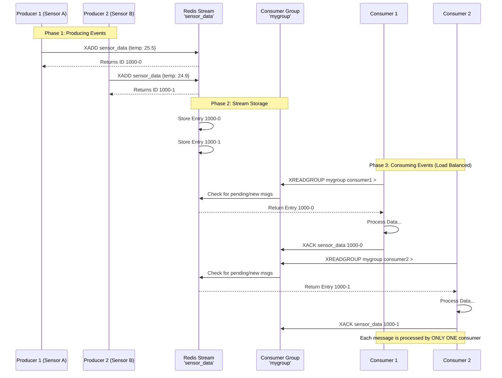

# 7. Redis as Streams (Event-Driven Systems)

**Description**: Introduced in Redis 5.0, **Streams** are a ***more robust and persistent messaging system compared to Pub/Sub***. 

They are append-only logs that support multiple consumers, consumer groups, and message acknowledgment, making them suitable *for event sourcing and complex message queues.*

**Real-World Scenarios**:

- **Event Sourcing**: Recording all state changes as a sequence of events.
- **Microservices Communication**: Reliable message passing between services.
- **IoT Data Ingestion**: High-throughput ingestion of time-series data.

### 1. The Concept: What is a Stream?

Imagine a **Stream** as an immutable ledger or a chat history.

- **Append-Only:** You can only add new entries to the end. You cannot modify or delete old entries easily (though you can trim them for space).
- **Ordered:** Every entry has a unique, time-based ID (e.g., `1712934567890-0`).
- **Persistent:** Unlike pub/sub (where messages are lost if no one is listening), Streams store messages until you explicitly delete them.

### 2. The Architecture: Producers, Consumers, and Groups

In an Event-Driven System, we usually have three roles:

1. **Producers:** Services that generate events (e.g., IoT sensors, User Clicks) and `XADD` them to the stream.
2. **Consumer Groups:** A logical grouping of consumers. This ensures **load balancing**. If you have 3 consumers in a group, Redis distributes messages among them so each message is processed only once.
3. **Consumers:** The workers that `XREADGROUP` messages, process them, and `XACK` (acknowledge) them.

### Why use Consumer Groups?

- **Without Groups (`XREAD`):** Every consumer gets *every* message (Broadcast pattern). Good for logging, bad for processing tasks.
- **With Groups (`XREADGROUP`):** Messages are split among consumers (Work Queue pattern). Good for scaling processing power.

---

### 3. Visualization with Mermaid

Here is a visual representation of how data flows in a Redis Stream system with Consumer Groups.



**Code Examples (Python)**:

Hello Muhammed! To truly understand how Redis Streams work in an event-driven system, we need to move beyond simple scripts and simulate a **real-world architecture**.

I will provide a complete, runnable Python example that simulates:

1. **Multiple Producers** (IoT Sensors) sending data asynchronously.
2. **A Consumer Group** with multiple workers processing that data in parallel.
3. **Reliability Mechanisms** (Acknowledgments and Pending Message handling).

### Prerequisites

You need the `redis` library:

```bash
pip install redis
```

*Ensure you have a Redis server running locally (`redis-server`).*

---

### The Complete Code Example

Save this as `redis_stream_demo.py`. I have added detailed comments to explain every step.

```python
import redis
import time
import threading
import random
import json

# -----------------------------------------------------------------------------
# Configuration
# -----------------------------------------------------------------------------
STREAM_NAME = "iot_sensor_stream"
GROUP_NAME = "sensor_processing_group"
CONSUMER_NAMES = ["worker_1", "worker_2", "worker_3"]
BLOCK_TIME_MS = 2000  # Wait 2 seconds for new messages
MAX_RETRIES = 3       # Max times to retry a failed message

# Initialize Redis Connection
r = redis.Redis(host='localhost', port=6379, db=0, decode_responses=True)

# -----------------------------------------------------------------------------
# Helper: Setup Stream and Group
# -----------------------------------------------------------------------------
def setup_stream_and_group():
    """
    Creates the stream and consumer group if they don't exist.
    """
    try:
        # Create consumer group starting from ID '0' (beginning of stream)
        # mkstream=True creates the stream if it doesn't exist
        r.xgroup_create(STREAM_NAME, GROUP_NAME, id='0', mkstream=True)
        print(f"[Setup] Consumer group '{GROUP_NAME}' created.")
    except redis.exceptions.ResponseError as e:
        if "BUSYGROUP" in str(e):
            print(f"[Setup] Consumer group '{GROUP_NAME}' already exists.")
        else:
            raise

# -----------------------------------------------------------------------------
# Role 1: Producer (Simulates IoT Sensors)
# -----------------------------------------------------------------------------
def producer(sensor_id, count=5):
    """
    Simulates a sensor sending data to the stream.
    """
    print(f"[Producer {sensor_id}] Starting...")
    for i in range(count):
        # Generate mock data
        data = {
            "sensor_id": sensor_id,
            "temperature": round(random.uniform(20.0, 30.0), 2),
            "humidity": round(random.uniform(40.0, 60.0), 2),
            "timestamp": time.time()
        }

        # XADD: Add to stream.
        # maxlen=1000 keeps the stream from growing infinitely (trimming old data)
        msg_id = r.xadd(STREAM_NAME, data, maxlen=1000, approximate=True)
        print(f"[Producer {sensor_id}] Sent: Temp={data['temperature']}°C | ID: {msg_id}")

        # Simulate variable sampling rate
        time.sleep(random.uniform(0.5, 1.5))

    print(f"[Producer {sensor_id}] Finished sending {count} messages.")

# -----------------------------------------------------------------------------
# Role 2: Consumer Worker (Processes Messages)
# -----------------------------------------------------------------------------
def consumer_worker(consumer_name):
    """
    Continuously reads from the stream, processes data, and acknowledges.
    """
    print(f"[{consumer_name}] Started listening...")

    while True:
        try:
            # XREADGROUP: Read new messages assigned to this consumer
            # '>' means "only new messages never delivered to any consumer in this group"
            messages = r.xreadgroup(
                GROUP_NAME,
                consumer_name,
                {STREAM_NAME: ">"},
                count=1,
                block=BLOCK_TIME_MS
            )

            if not messages:
                # No new messages received within block time
                continue

            # Process each message
            for stream, msg_list in messages:
                for msg_id, fields in msg_list:
                    process_message(consumer_name, msg_id, fields)

        except Exception as e:
            print(f"[{consumer_name}] Error: {e}")
            time.sleep(1)

def process_message(consumer_name, msg_id, fields):
    """
    Simulates business logic processing.
    """
    print(f"[{consumer_name}] Processing ID: {msg_id} | Data: {fields}")

    # Simulate processing time
    time.sleep(0.5)

    # Simulate occasional failure (to demonstrate pending messages)
    if random.random() < 0.1:  # 10% chance of failure
        print(f"[{consumer_name}] ⚠️ Failed to process {msg_id}. Will retry later.")
        return  # Note: We do NOT acknowledge, so it stays in Pending List

    # XACK: Acknowledge successful processing
    r.xack(STREAM_NAME, GROUP_NAME, msg_id)
    print(f"[{consumer_name}] ✅ Acknowledged {msg_id}")

# -----------------------------------------------------------------------------
# Role 3: Pending Message Handler (The "Safety Net")
# -----------------------------------------------------------------------------
def pending_message_handler():
    """
    Checks for messages that were delivered but not acknowledged (crashed/failed).
    Re-claims them for processing.
    """
    print("[Pending Handler] Started monitoring pending messages...")

    while True:
        try:
            # XPENDING: Check for messages idle for more than 10 seconds (10000ms)
            pending = r.xpending_range(STREAM_NAME, GROUP_NAME, min_idle_time=10000, count=10)

            if pending:
                for p in pending:
                    msg_id = p['message_id']
                    consumer = p['consumer']
                    idle_time = p['time_since_delivered']

                    print(f"[Pending Handler] Found idle msg {msg_id} (idle: {idle_time}ms) from {consumer}")

                    # XCLAIM: Take ownership of the message
                    claimed = r.xclaim(
                        STREAM_NAME,
                        GROUP_NAME,
                        "recovery_worker",  # A special worker for recovery
                        min_idle_time=10000,
                        message_ids=[msg_id]
                    )

                    if claimed:
                        for msg_id_claimed, fields in claimed:
                            print(f"[Pending Handler] Re-processing {msg_id_claimed}")
                            # Process and Ack
                            process_message("recovery_worker", msg_id_claimed, fields)
            else:
                time.sleep(5)  # Check every 5 seconds if nothing is pending

        except Exception as e:
            print(f"[Pending Handler] Error: {e}")
            time.sleep(5)

# -----------------------------------------------------------------------------
# Main Execution
# -----------------------------------------------------------------------------
if __name__ == "__main__":
    # 1. Setup
    setup_stream_and_group()

    # Clear previous data for clean demo (Optional)
    r.delete(STREAM_NAME)
    setup_stream_and_group()

    # 2. Start Consumers (in separate threads)
    threads = []
    for name in CONSUMER_NAMES:
        t = threading.Thread(target=consumer_worker, args=(name,))
        t.daemon = True
        t.start()
        threads.append(t)

    # Start Pending Handler
    ph_thread = threading.Thread(target=pending_message_handler)
    ph_thread.daemon = True
    ph_thread.start()
    threads.append(ph_thread)

    # 3. Start Producers (in separate threads)
    producer_threads = []
    for i in range(1, 4):  # 3 Sensors
        t = threading.Thread(target=producer, args=(f"Sensor_{i}", 5))
        t.start()
        producer_threads.append(t)

    # Wait for producers to finish
    for t in producer_threads:
        t.join()

    print("\\n--- All producers finished. Waiting for consumers to drain queue... ---")

    # Keep main thread alive to let consumers finish processing
    time.sleep(10)

    print("--- Demo Complete ---")
```

### How to Run This

1. Start your Redis server: `redis-server`
2. Run the script: `python redis_stream_demo.py`

### What You Will See in the Output

1. **Producers** will send messages like `Sensor_1 sent Temp=25.5°C`.
2. **Consumers** (`worker_1`, `worker_2`, `worker_3`) will pick up these messages. Notice that **each message is processed by only ONE worker**. This is the load balancing power of Consumer Groups.
3. **Acknowledgments**: You’ll see `✅ Acknowledged` messages.
4. **Failures**: Occasionally, a worker will say `⚠️ Failed to process`. It will **NOT** acknowledge it.
5. **Recovery**: After 10 seconds (the `min_idle_time`), the `[Pending Handler]` will detect the unacknowledged message, `XCLAIM` it, and process it again. This demonstrates **fault tolerance**.

### Key Takeaways for Muhammed

| Concept | Command | Purpose |
| --- | --- | --- |
| **Write** | `XADD` | Producers add events to the log. |
| **Read New** | `XREADGROUP ... >` | Consumers get *new* undelivered messages. |
| **Acknowledge** | `XACK` | Tells Redis "I’m done, delete from Pending List." |
| **Pending Check** | `XPENDING` | Finds messages that were delivered but not ACKed. |
| **Reclaim** | `XCLAIM` | Takes over a stuck message from a crashed consumer. |

This code illustrates a **robust, production-ready pattern** for event-driven systems using Redis Streams. Let me know if you want to dive deeper into any specific part!

### Summary

- **Redis Streams** = Persistent, ordered logs.
- **Producer** = `XADD`
- **Consumer Group** = Load balancing mechanism.
- **Consumer** = `XREADGROUP` + `XACK`
- **Reliability** = Achieved via the Pending Entries List (PEL) and Acknowledgments.

This pattern is excellent for IoT data ingestion (like your sensor example), order processing systems, or activity feeds.

Do you want to see how to handle **failed messages** (using `XPENDING` and `XCLAIM`) next? That’s the next level of robustness!